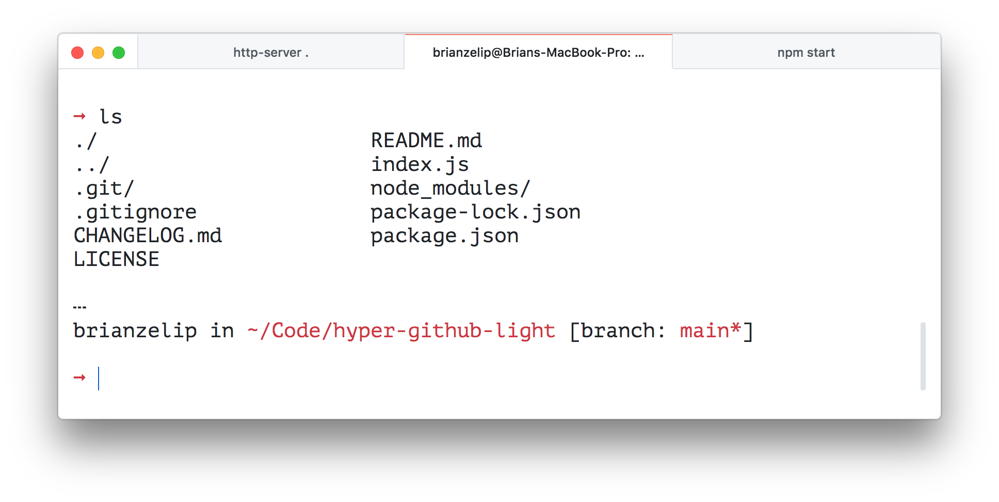

# hyper-github-light


[GitHub Light Default theme](https://github.com/primer/github-vscode-theme), as applied to VS Code, for [Hyper](https://github.com/vercel/hyper).



## Install

```bash
hyper install hyper-github-light
```

## Related

- [hyper-github-dark-dimmed](https://github.com/brianzelip/hyper-github-dark-dimmed)

## Contributing

Open a PR!

## Author

Brian Zelip, [https://zelip.me](https://zelip.me)

## License

MIT
